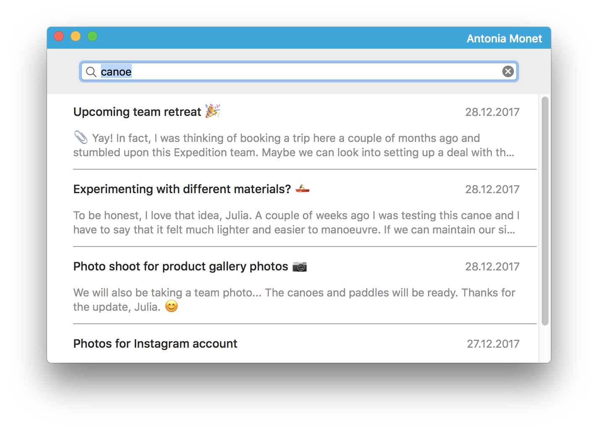

# Albe's Twist

This is an application for macOS that implements a simple integration with [Twist](https://twistapp.com)'s APIs.

## General remarks

My goal while developing the application was to show a few of the architectural patterns I like, focusing more on the structure of the project than on specific tools and libraries. This is the main reason why I haven't used any external dependencies (e.g., Alamofire, PromiseKit, Realm, ...): the use of specific tools may be discussed with your team, while a good architecture should allow you to swap them out as needed, instead of being forced to depend on their specific details.

Some of the concepts I've applied here are: 

* **Flow coordinators**: I like to use them a lot in the iOS world, but they can also be applied to macOS development, with a few caveats (be careful if you have multiple windows, ...). I find they really help define the flow of your app, especially when software becomes much more complex.
* **Networking layer**:
	*  **Abstracted away as a protocol**: easily injectable as a dependency and mockable (as shown in `MainViewPresenterTests.swift`). 
	*  **Request objects**: wrapping their configuration parameters and grouped by endpoint. As a solution, it's a bit over-engineered for such a small project, but it shows one of the ways of wrapping a bigger API.
*  **Data Source layer**: abstracting away from the specific framework used to persist data in the app. Once again, it makes the dependency more easily injectable, mockable, replaceable.
*  **MVP-like architecture for the UI**: the View becomes very simple, as the Presenter contains the logic that manages events and prepares data to be displayed.

I would have also liked to introduce Configurator objects to set up different properties of the view controllers (e.g., some of the settings that the coordinators do themselves after instantiating the view controllers), and simplified the Presenters, but that would have required more time and made this project even more complex.

Regarding my choice of workflow, since I worked on the project on my own, I used feature branches off `develop`, merging without fast forwards, to preserve a nice and easy-to-read (in my opinion) history of the project. In a team setting with more time available, I would have definitely set up issues and referenced them in the commits, as well as discussed a more complex flow (e.g., Gitflow or forks and pull requests).

If the scope of the project had been bigger, I would have definitely done TDD and aimed at a high unit test coverage. Here, instead, I've just implemented a couple of very simple test cases to illustrate how some of the modules in the project can be easily tested thanks to mocking and dependency injection.

## Choices and Assumptions

* I've decided to limit the application to a single window, to keep it simple.
* The login form is presented as a sheet, not in a separate window.
* The local database is basically used as a cache to store successful login info and last search results.
* Performing a new search overwrites previously-stored results in the database.
* Once a user has logged in, they can't log out, unless you clear the database.

## Improvements

The project is by no means perfect and it could be improved in several different areas, such as:

* Sorting search results by date
* Reviewing visibility for properties and methods in all classes (almost everything is `internal`, with a few exceptions being `private` where it made sense).
* Allowing a user to log out and making sure there's some form of token refresh if the login expires at some point.
* Improving error handling, especially for the interactions with the backend, also by showing better, more informative messages to the user.
* Including a linter (e.g., SwiftLint) to enforce code style and conventions.
* Form validation at login time.
* Using `NSLocalizedString` everywhere a `String` is going to be displayed to the user, to make i18n easier.
* Formatting the dates presented to the user depending on their time zone.
* Expanding the test suite to cover most of the code.
* Adding UI tests to cover main use cases.
* Debugging a few scenarios that may lead to crashes.